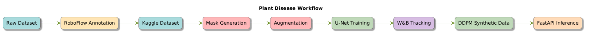
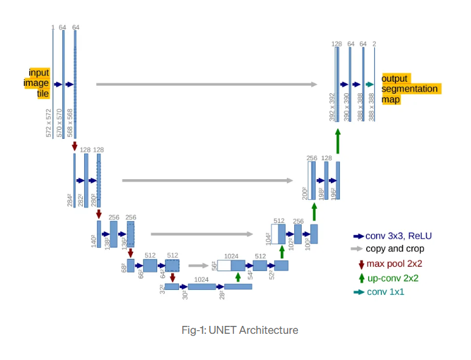
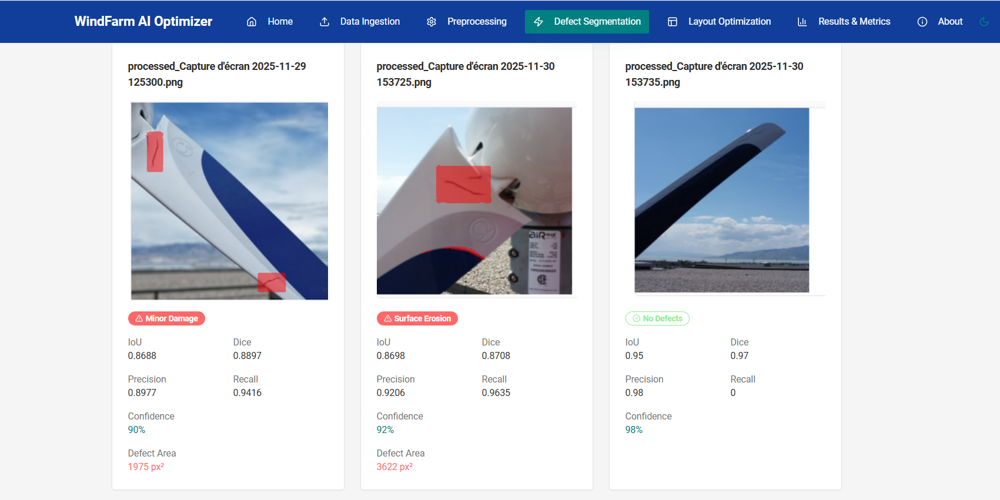

# 🌬️ Wind Blade Segmentation & Monitoring System

<div align="center">
  
  
  
  
  
  
  
</div>

<p align="center">
  <em>AI-powered system for wind turbine blade segmentation, fault detection, and performance monitoring.</em>
</p>

---

## 🚀 Project Overview

Wind turbines require **regular inspection** to ensure efficiency and safety. Manual inspection is **time-consuming and error-prone**, especially for large wind farms.  

This project uses **U-Net for segmentation of wind turbine blades**, identifies faulty areas, and generates masks for maintenance. It leverages **RoboFlow + YOLOv8** for efficient annotation and **DDPM for synthetic data generation**. Experiment tracking and MLOps are handled via **Weights & Biases**, enabling reproducible workflows.

**Impact:**

- Reduce downtime through automated blade inspections.  
- Support predictive maintenance with high-accuracy segmentation.  
- Provide clear visualizations for engineers to prioritize repairs.  

---

## 🖼️ Methodology Diagrams

### 1️⃣ Pipeline Overview
  
*Shows full workflow: Kaggle dataset → RoboFlow annotation → mask generation → augmentation → U-Net training → DDPM synthetic data → W&B tracking → FastAPI inference.*

### 2️⃣ U-Net Architecture
  
*Standard U-Net with skip connections for precise blade segmentation.*

---

## 🏭 Dataset Information

**Source:** [Kaggle Blade Images Dataset](https://www.kaggle.com/datasets/asmadaab/blade-images)

**Annotation:** Done using **RoboFlow + YOLOv8** for accurate polygon-based labeling of faulty regions.

**Details:**

| Split | Category | Count |
|-------|---------|-------|
| Train | Healthy | 6,906 |
| Train | Faulty  | 6,906 |
| Val   | Healthy | 1,727 |
| Val   | Faulty  | 653  |

**Preprocessing:**

- Resize to 224×224 pixels.  
- Generate masks from annotations.  
- Augment with flips, rotations, brightness/contrast adjustments.  
- Balance dataset via oversampling faulty class.  

---

## ⚙️ Tech Stack

<div align="center">

| Layer | Technologies |
|-------|-------------|
| **Frontend** | React, Tailwind CSS , Vite|
| **Backend** | FastAPI, Uvicorn |
| **ML / DL** | PyTorch, U-Net, DDPM, Albumentations |
| **Annotation** | RoboFlow, YOLOv8 |
| **MLOps** | Weights & Biases |
| **Visualization** | Matplotlib, PIL, OpenCV |

</div>

---

## 🧰 Training & Metrics

**U-Net Training Details:**

- Loss: `BCEWithLogitsLoss`  
- Optimizer: Adam, lr=1e-3  
- Epochs: 20  
- Batch size: 8  

**Validation Metrics:**

| Metric    | Value   |
|-----------|---------|
| IoU       | 0.8596  |
| Dice      | 0.8804  |
| Precision | 0.9064  |
| Recall    | 0.9499  |

**Class Distribution (Train):**

```text
Healthy    6906
Faulty     6906
```

**Validation Distribution:**

```text
Healthy    1727
Faulty      653
```

**MLOps Tracking:**  
### All experiments, metrics, and training logs are tracked with Weights & Biases for reproducibility.
Note: While U-Net experiments were initially run on Colab (using GPU), subsequent runs on Kaggle encountered limitations, and Weights & Biases tracking was not available there.
---

## 🔧 Installation

### 1️⃣ Clone the repository
```bash
git clone https://github.com/tass25/Wind-Farm-Project.git
cd Wind-Farm-Project
```

### 2️⃣ Backend setup
```bash
cd backend
pip install -r requirements.txt
uvicorn main:app --reload
```

### 3️⃣ Frontend setup
```bash
cd frontend
npm install
npm start
```

---

## 📡 API Endpoints

### 🔹 Batch & Upload Management
| Endpoint | Method | Description |
|---------|--------|-------------|
| `/upload` | POST | Upload a batch of images and/or weather files. Requires `batch_name` and files. |
| `/batches` | GET | List all uploaded batches with metadata. |
| `/batches/{batch_name}` | GET | Get details and metadata for a specific batch. |

### 🔹 Preprocessing
| Endpoint | Method | Description |
|---------|--------|-------------|
| `/preprocess/{batch_name}` | POST | Preprocess all images in the batch (resize to 256x256, compute stats, save results). |
| `/preprocessing-status/{batch_name}` | GET | Get preprocessing status and results for a batch. |
| `/processed-image/{batch_name}/{filename}` | GET | Fetch a specific preprocessed image. |

### 🔹 Segmentation (U-Net + DDPM)
| Endpoint | Method | Description |
|---------|--------|-------------|
| `/segment-batch/{batch_name}` | POST | Run segmentation on preprocessed images in a batch. Generates overlays and metrics. |
| `/segmentation-results/{batch_name}` | GET | Retrieve JSON results of segmentation for a batch. |
| `/segmented-image/{batch_name}/{filename}` | GET | Fetch a specific segmented overlay image. |

### 🔹 Predictions
| Endpoint | Method | Description |
|---------|--------|-------------|
| `/predict` | POST | Predict mask for a single uploaded image. Returns overlay PNG. |

### 🔹 Context / Layout Generation (Wind + Vision API)
| Endpoint | Method | Description |
|---------|--------|-------------|
| `/generate` | POST | Generate turbine layout from bounding box or center coordinates. Returns points, mask, and optional preview PNG. |

### 🔹 Batch Images
| Endpoint | Method | Description |
|---------|--------|-------------|
| `/batch-image/{batch_name}/{filename}` | GET | Fetch a raw uploaded image from a batch. |
| `/batch-images/{batch_name}` | GET | List all images in a batch with their details. |

### 🔹 Segmentation Summary
| Endpoint | Method | Description |
|---------|--------|-------------|
| `/api/batches` | GET | Get a list of all segmentation batch results across the system. |

---

## 🖥️ Screenshots

### Blade Segmentation Results


### Data Augmentation & DDPM Visualization


---

## 📌 Future Improvements

- Extend pipeline for **real-time drone inspection**.  
- Integrate **predictive maintenance models** based on segmentation masks.  
- Expand dataset with **additional DDPM-generated samples** to improve rare fault detection.  

---

</div>
